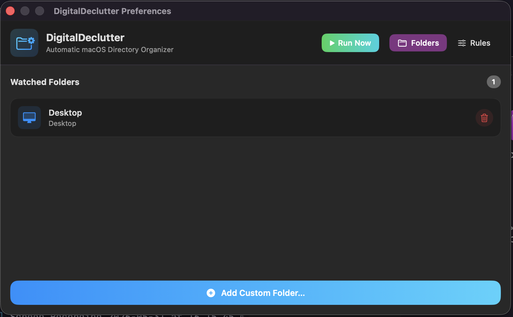
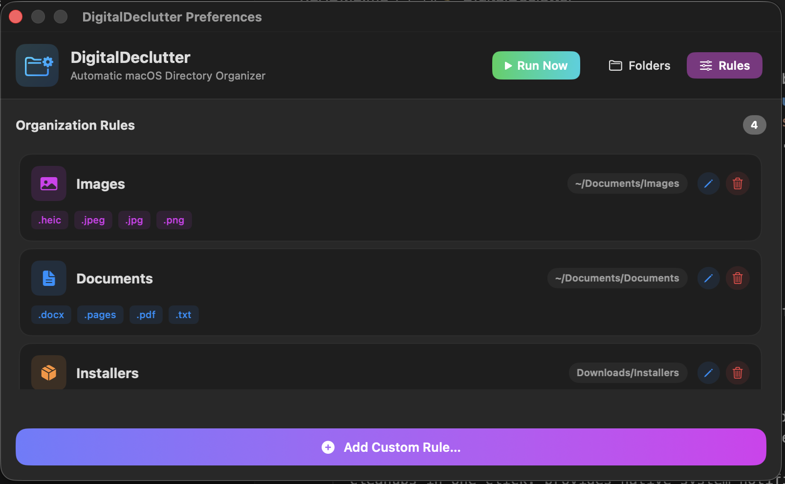

# 🧹 DigitalDeclutter

A lightweight, native macOS file organizer that runs both as a menu bar application and a command-line interface. Built in Swift, **DigitalDeclutter** automatically scans and organizes files from cluttered folders (like your `Desktop` and `Downloads`) into structured, category-specific subfolders based on file extensions.

## 🖥️ Graphical User Interface (GUI) Walkthrough

DigitalDeclutter runs as a native macOS menu bar app, featuring a sleek, modern visual preferences window. The UI is split into two primary sections:

### 1. Folders Tab (Watched Directories)



This tab lets you configure which directories on your Mac are monitored and organized by the application.

- **What it does**: Displays all directories currently active for scanning. Standard system directories (like your Desktop and Downloads) are represented with custom icons, alongside any custom folders you select.
- **What you can do**:
  - **Add Custom Folders**: Click the **"Add Custom Folder..."** button (or press `⌘N`) to select a directory on your filesystem using a native macOS directory picker.
  - **Remove Folders**: Click the red trash icon next to a folder to stop monitoring it. A confirmation dialog prevents accidental deletions.
  - **Run Organizer Immediately**: Click the **"Run Now"** button in the window header to organize all files in your watched folders on the spot.
  - **Visual Feedback**: Hover over folders to see focus borders, and watch for the green **"Saved"** indicator in the header confirming that your settings have been saved automatically to the JSON configuration file.

### 2. Rules Tab (Organization Rules)



This tab maps file categories and file extensions to their final destination subfolders.

- **What it does**: Lists all configured rules, each represented by a category name, a custom color-tinted icon (e.g., purple photo icon for Images, blue document icon for Documents, orange shipping box for Installers), a destination path, and tag chips displaying the matching file extensions.
- **What you can do**:
  - **Add Custom Rules**: Click **"Add Custom Rule..."** (or press `⌘N`) to configure a new category name, enter comma-separated extensions (e.g., `zip, rar, tar`), and select the destination directory.
  - **Edit Rules**: Click the pencil icon next to any rule to open the rule editor and change its extensions or destination folder.
  - **Delete Rules**: Click the trash icon next to a rule to delete it permanently from your sorting configuration.
  - **Reorder Execution Precedence**: Click and drag rules to change their order, determining which category rules take precedence.

## 📂 Project Overview

DigitalDeclutter helps keep your workspace clean with zero effort. It detects files matching your configured rules, resolves name collisions gracefully, and avoids touching active downloads or system files.

### Core Features

- **Dual Interface**:
  - 🖥️ **CLI (`DigitalDeclutterCLI`)**: A fast command-line interface optimized for scripting, automated cron jobs, and quick manual cleanups.
  - 📥 **GUI (`DigitalDeclutterUI`)**: A native macOS Menu Bar application that triggers cleanups in one click, provides native system notifications, and features a visual configuration editor.
- **Intelligent Category Mapping**: Group files into clean categories like Images, Documents, and Installers.
- **Safe Dry-Run Mode (`--dry-run`)**: Simulations let you preview what files will move and where they will go, without making changes to the filesystem.
- **Local Sort Mode (`--local`)**: Moves files to folders _inside_ their source directory (e.g. `~/Desktop/Images`) instead of centralizing them (CLI only).
- **Name Collision Handling**: Automatically appends incremental suffixes (e.g., `_1`, `_2`) if a file with the same name already exists at the destination, preventing accidental overwriting.
- **Safety Exclusions**: Skips active downloads (`.crdownload`, `.download`, `.part`, `.tmp`) and hidden system files (like `.DS_Store`).
- **Persistent Settings**: Loads and saves preferences instantly in a shared JSON file. Changes made in the GUI Settings window apply to the CLI tool automatically.

---

## 🏗 Project Structure

The project is built as a Swift Package with modular targets:

```
file-organiser/
├── Package.swift               # Swift Package Manager manifest
├── Gemini.md                   # Developer & AI guide
└── Sources/
    ├── DigitalDeclutterCore/   # Shared framework (Models, Organizer engine, Persistence)
    ├── DigitalDeclutterCLI/    # Terminal interface and argument parsing
    └── DigitalDeclutterUI/     # macOS Menu Bar application and Preferences UI
```

- **[DigitalDeclutterCore](file:///Users/harrycraven/Desktop/dev/file-organiser/Sources/DigitalDeclutterCore)**: Contains the core sorting engine (`FileOrganizer.swift`), the JSON parser (`Persistence.swift`), and structures (`Models.swift`).
- **[DigitalDeclutterCLI](file:///Users/harrycraven/Desktop/dev/file-organiser/Sources/DigitalDeclutterCLI)**: Translates arguments and executes organization passes synchronously.
- **[DigitalDeclutterUI](file:///Users/harrycraven/Desktop/dev/file-organiser/Sources/DigitalDeclutterUI)**: Houses the menu bar item (`App.swift`) and the visual preference pane (`SettingsView.swift`).

---

## 🛠 Getting Started

### Prerequisites

- **macOS**: 14.0 (Sonoma) or newer.
- **Swift / Xcode Command Line Tools**: Swift 5.9+ compiler.

### Build and Run

To compile a release build:

```bash
swift build -c release
```

You can run the targets directly using Swift Package Manager.

#### 1. Running the CLI Tool

- **Display help & usage parameters:**
  ```bash
  swift run DigitalDeclutterCLI --help
  ```
- **Perform a Dry Run (safe simulation):**
  ```bash
  swift run DigitalDeclutterCLI --dry-run
  ```
- **Execute organization (moves files):**
  ```bash
  swift run DigitalDeclutterCLI
  ```
- **Organize files in-place (locally within their source directory):**
  ```bash
  swift run DigitalDeclutterCLI --local
  ```

#### 2. Running the Menu Bar App

To launch the GUI menu bar helper in the background:

```bash
swift run DigitalDeclutterUI
```

- Click on the folder icon in the menu bar to:
  - Trigger **Run Organizer Now** or **Run as Dry Run**.
  - Open **Preferences...** (`⌘,`) to edit scan paths, rules, and extensions.
  - Quit the application (`⌘Q`).

---

## ⚙️ Configuration

All configurations are stored inside a single JSON file at:

```
~/Library/Application Support/DigitalDeclutter/config.json
```

On the first run, the default configuration file is automatically created with the following defaults:

```json
{
  "rules": [
    {
      "category": "Images",
      "extensions": ["png", "jpg", "jpeg"],
      "destinationSubpath": "Pictures/Screenshots"
    },
    {
      "category": "Documents",
      "extensions": ["pdf", "docx", "pages"],
      "destinationSubpath": "Documents/Organized"
    },
    {
      "category": "Installers",
      "extensions": ["dmg", "pkg"],
      "destinationSubpath": "Downloads/Installers"
    }
  ],
  "ignoredExtensions": ["crdownload", "download", "part", "tmp"],
  "sourceSubpaths": ["Desktop", "Downloads"]
}
```

- **`rules`**: Category rules defining target extensions and destination paths (subpaths relative to your home directory, e.g. `~/Pictures/Screenshots`).
- **`ignoredExtensions`**: File extensions to skip completely.
- **`sourceSubpaths`**: Root-level subpaths inside your home directory that the organizer scans.

---

## 💡 Development and Contributing

1. **Modify Engines/Persistence**: Edit files in [Sources/DigitalDeclutterCore](file:///Users/harrycraven/Desktop/dev/file-organiser/Sources/DigitalDeclutterCore).
2. **Modify CLI UI**: Edit [Sources/DigitalDeclutterCLI/main.swift](file:///Users/harrycraven/Desktop/dev/file-organiser/Sources/DigitalDeclutterCLI/main.swift).
3. **Modify GUI Settings/Views**: Edit files in [Sources/DigitalDeclutterUI](file:///Users/harrycraven/Desktop/dev/file-organiser/Sources/DigitalDeclutterUI).
